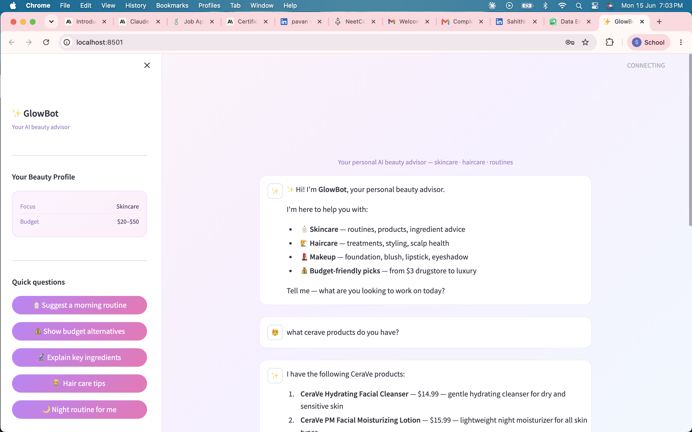
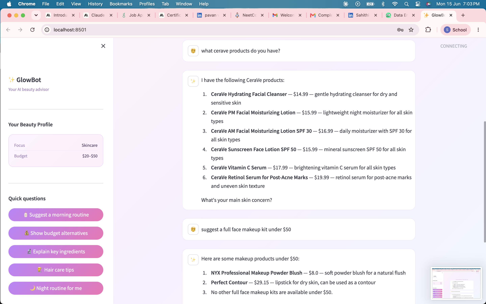
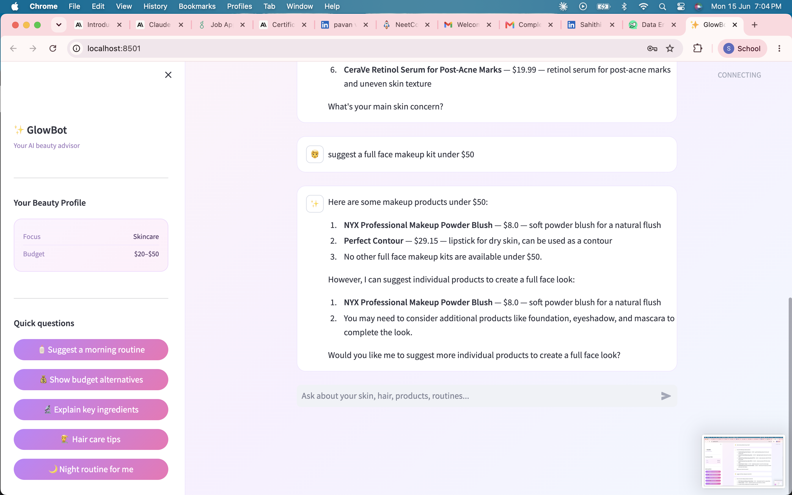

# ✨ GlowBot — AI Beauty Advisor Chatbot

> A personalized AI beauty advisor built with **LangChain + Groq (Llama 3.3) + Streamlit** — recommends real skincare, haircare and makeup products based on your skin type, hair type, concerns and budget.

---

## 🌸 What GlowBot Does

- 🧴 **Skincare advice** — routines, serums, moisturizers, sunscreens for your skin type
- 💇 **Haircare advice** — shampoos, conditioners, treatments for your hair type
- 💄 **Makeup recommendations** — foundation, blush, mascara and more
- 💰 **Budget-aware** — suggests products within your price range (from $3 drugstore to luxury)
- 🔬 **Ingredient explainer** — tells you what to look for and what to avoid
- 🧠 **Memory** — remembers your profile throughout the conversation

---

## 🖥️ Screenshots





---

## 🛠️ Tech Stack

| Tool | Purpose |
|---|---|
| Python | Core language |
| LangChain | LLM orchestration + memory |
| Groq (Llama 3.3 70B) | Free AI model API |
| Streamlit | Chat UI |
| JSON + Keyword Search | 285 product database with smart search |

---

## 🚀 Setup Guide

### Step 1 — Clone the repo
```bash
git clone https://github.com/sahithi-yerramsetty/Glow-beauty-chatbot.git
cd Glow-beauty-chatbot
```

### Step 2 — Install dependencies
```bash
pip install -r requirements.txt
```

### Step 3 — Get a FREE Groq API Key (2 minutes)

1. Go to **[console.groq.com](https://console.groq.com)**
2. Click **Sign Up** — Google login works
3. Click **API Keys** in left sidebar
4. Click **Create API Key** → name it → click **Submit**
5. **Copy the key** — starts with `gsk_`

> 💡 Groq is completely **free** — no credit card, no limits for personal use!

### Step 4 — Run the app
```bash
streamlit run app.py
```

### Step 5 — Open in browser

Streamlit opens automatically at **http://localhost:8501**

1. Paste your `gsk_` API key in the **sidebar**
2. Click **Start chatting ✨**
3. Tell GlowBot your skin type, hair type, concern and budget!

---

## 💬 Example Prompts to Try

```
"I have oily skin with dark spots, suggest The Ordinary serums under $20"
"I have curly frizzy hair, suggest K18 products"
"suggest a blush and lipstick under $10"
"I have sensitive skin with redness, what moisturizer should I use?"
"suggest a budget shampoo and conditioner under $10"
"I am in my 30s and worried about wrinkles, what serum should I use?"
```

---

## 📦 Product Database

285 real products across 3 categories:

| Category | Count | Brands |
|---|---|---|
| 🧴 Skincare | 103 | CeraVe, La Roche-Posay, The Ordinary, Aveeno, Paula's Choice, EltaMD |
| 💇 Haircare | 71 | OUAI, K18, Kerastase, Moroccanoil, Redken, Mielle, Crown Affair, Living Proof |
| 💄 Makeup | 111 | Maybelline, NYX, e.l.f., Milani, Wet n Wild, Physicians Formula |

---

## 📁 Project Structure

```
Glow-beauty-chatbot/
├── app.py              # Streamlit UI + chat interface
├── chatbot.py          # LangChain + Groq LLM + system prompt
├── vector_store.py     # Product search with brand detection + budget filtering
├── products.json       # 285 real beauty products database
├── requirements.txt    # Python dependencies
└── README.md
```

---

## 🧠 How It Works

```
User types message
        ↓
detect_focus() — skincare / haircare / makeup?
        ↓
search_products() — keyword search across 285 products
        ↓
Budget filter — only products within price range
        ↓
Brand detection — "ordinary" → "The Ordinary"
        ↓
Top 6 products injected into LLM prompt (RAG)
        ↓
Groq Llama 3.3 generates personalized response
        ↓
GlowBot replies with real product recommendations ✨
```

---

## 🔮 Future Improvements

- [ ] ChromaDB vector embeddings for semantic search
- [ ] User account system to save beauty profiles
- [ ] Image upload — analyze skin from selfie
- [ ] Azure deployment with Cosmos DB product storage
- [ ] Real-time product pricing from Sephora/Ulta API

---

## 👩‍💻 Built By

**Sahithi Yerramsetty** — AI Engineer  
[LinkedIn](https://linkedin.com/in/sahithi-yerramsetty) | [GitHub](https://github.com/sahithi-yerramsetty)

---

> ⭐ If you found this useful, give it a star on GitHub!